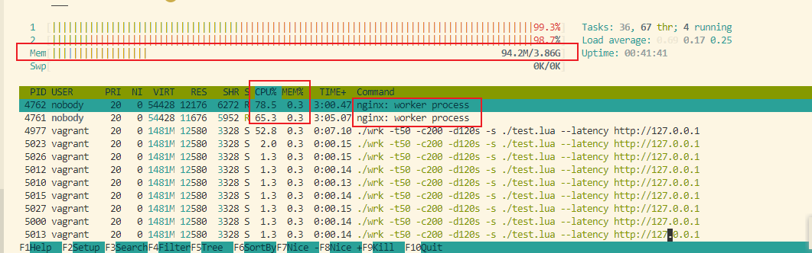
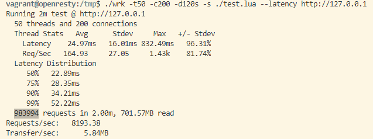
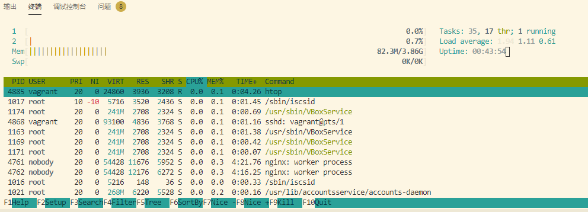

# lua-resty-maxminddb-vagrant
vagrant project for openresty's lib lua-resty-maxminddb


### Test env

1. ubuntu 16.04.7 LTS (Xenial Xerus) amd64 ( `cat /etc/os-release` )
2. wrk version 4.10
3. openresty version openresty/1.17.8.2 ( `openresty -v` )
4. lua-resty-maxminddb version 1.3.2 ( `sudo opm --install-dir /usr/local/openresty/ list` )
5. maxmind db is `/tmp/GeoLite2-Country.mmdb` ( `cat /usr/local/openresty/nginx/conf/nginx.conf | grep mmdb` )
6. libmaxminddb-dev:amd64 and  libmaxminddb0:amd64 and mmdb-bin version 1.0.4-2.1 , libgeoip1:amd64 version 1.6.9-1,geoipupdate version 2.2.1-1 , geoip-database version 20160408-1 ( `dpkg -l | grep geo` )
7. `GeoLite2-Country_20200929.tar.gz` means GeoLite2-Country db version is 20200929 (this repo's GeoLite2-Country.mmdb file)

### Usage

```bash

## install virtualbox + vagrant

vagrant up
vagrant ssh
cd /tmp

./wrk -t50 -c200 -d120s -s ./test.lua --latency http://127.0.0.1

# use `htop` command to monitoring memory and cpu usage
# when your os is windows 10,must be run `set VAGRANT_PREFER_SYSTEM_BIN=0` before `vagrant ssh`
# ref https://github.com/hashicorp/vagrant/issues/9950#issuecomment-400355385
```

### Screenshots

#### Running Test

> Htop Screenshots



#### After Test

> Wrk Result



    vagrant@openresty:/tmp$ ./wrk -t50 -c200 -d120s -s ./test.lua --latency http://127.0.0.1
    Running 2m test @ http://127.0.0.1
    50 threads and 200 connections
    Thread Stats   Avg      Stdev     Max   +/- Stdev
        Latency    25.73ms   24.23ms 987.43ms   98.34%
        Req/Sec   166.19     28.21     1.32k    83.94%
    Latency Distribution
        50%   22.96ms
        75%   27.39ms
        90%   33.08ms
        99%   60.74ms
    989959 requests in 2.00m, 705.81MB read
    Requests/sec:   8243.20
    Transfer/sec:      5.88MB

> Htop Screenshots
> 
